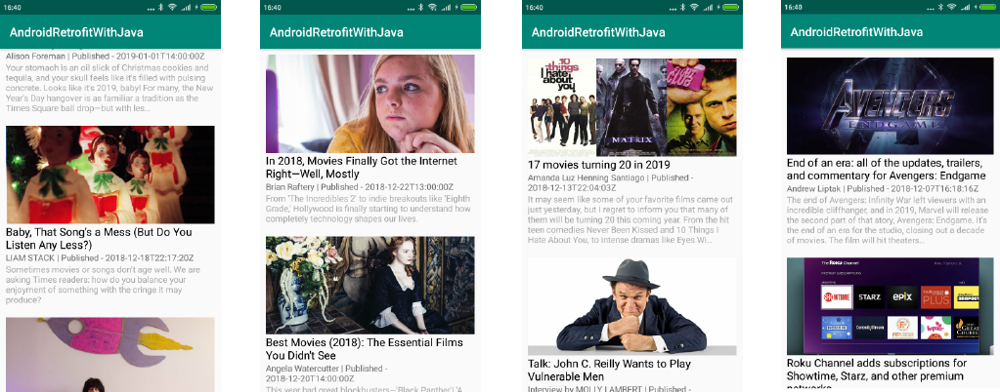

# Android-Retrofit-With-Java

## About this project

In this project we will build movies article app using <B>Retrofit</B>

### App Features
* Showing movies article from [News Api](https://newsapi.org)

## App demo 

## Contributing

Anyone can contribute in this project.

## Authors

**Shantu Chandra Dash** 
* [GitHub](https://github.com/shantudas)
* [Facebook](https://www.facebook.com/shantudashbd)
* [Linkedin](https://www.linkedin.com/in/shantudashbd/)

## License

This project is licensed under the MIT License - see the [LICENSE.md](https://github.com/shantudas/Android-Architecture-Components-Java/blob/master/LICENSE) file for details
